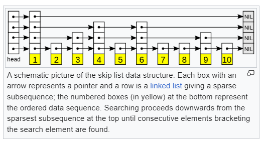

# What are SkipLists 
Skip lists are a probabilistic data structure that seem likely to supplant balanced trees as the implementation method of choice for many applications. Skip list algorithms have the same asymptotic expected time bounds as balanced trees and are simpler, faster and use less space.

<i>
— William Pugh, Concurrent Maintenance of Skip Lists (1989)
</i>

## Properties of Significantly Large Skip Lists
<b> Optimal number of levels is log n</b>
<b> The expected number of nodes at level i is n/2i.</b>
<b> Search is O(log n) expected time. </b>
<b> Insertion is O(log n) expected time.</b>
<b> Deletion is O(log n) expected time.</b>
<b> Additional Space is O(n) space complexity</b>

# Goals
- [x] Implement a SkipList in C++.
- Have Search , Insert and Delete operations.
- [ ] Have a GUI to visualize the SkipList.
- [ ] Have a GUI to visualize the SkipList operations.

# References
- [Skip Lists: A Probabilistic Alternative to Balanced Trees](https://15721.courses.cs.cmu.edu/spring2018/papers/08-oltpindexes1/pugh-skiplists-cacm1990.pdf)
- [Wikipedia page on Skip Graphs](https://en.wikipedia.org/wiki/Skip_graph).

